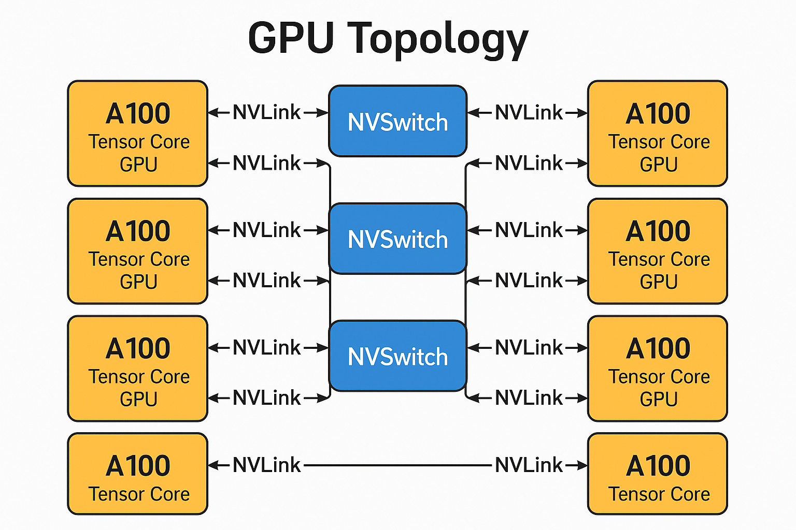
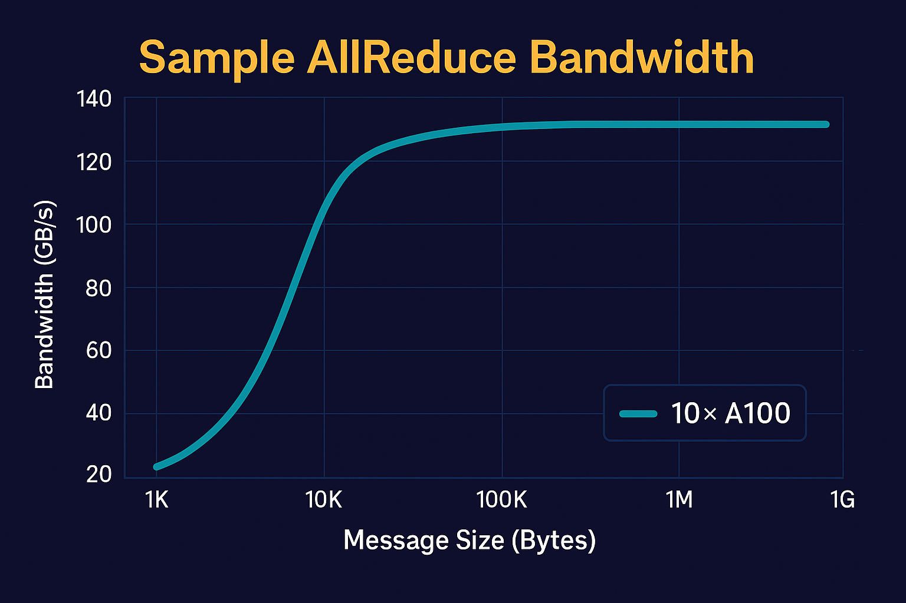

# GPU RDMA Communication Lab — **8×A100 Edition**

<p align="left">
  <!-- Replace OWNER/REPO with your GitHub path, e.g., eunki-7/gpu-rdma-comm-lab -->
  <a href="https://github.com/OWNER/REPO/stargazers"></a>
  <a href="https://github.com/OWNER/REPO/pulls"></a>
  <a href="https://github.com/OWNER/REPO/blob/main/LICENSE"></a>
  
  
  
  
</p>

**NCCL · RDMA · CUDA-aware MPI (GPUDirect RDMA)**

A deep-dive, hands-on lab that isolates **multi-GPU, multi-node communication** for HPC/AI workloads—now scaled to **10× NVIDIA A100**.

- **NCCL collectives**: AllReduce / AllGather microbenchmarks  
- **RDMA verbs**: C (libibverbs + librdmacm) ping-pong (latency / throughput)  
- **CUDA-aware MPI**: GPU buffer AllReduce using **GPUDirect RDMA**  
- **Lightweight analysis**: parse & plot bandwidth/latency curves

> **Goal** — Demonstrate core communication mechanics (topology, latency, bandwidth) without full MLOps stacks.

---

  
*Figure 1 — Topology: 5 nodes × 2 GPUs (intra-node NVLink, inter-node RDMA)*

---

## 📂 Repository Structure (with comments)
```text
gpu-rdma-comm-lab/
├─ README.md                           # Full guide for 10×A100 edition (images included)
│
├─ 00-prereq/                          # Sanity checks for GPU, RDMA, network
│  └─ sanity.sh                        # Prints nvidia-smi, ibv_devinfo, rdma_cm, interfaces, env hints
│
├─ 10-nccl-bench/                      # NCCL collectives: all_reduce_perf / all_gather_perf
│  ├─ Dockerfile                       # Builds nccl-tests on CUDA 12.4 (with UCX/MPI)
│  ├─ hostfile.10xA100                 # 5 nodes × 2 slots = 10 ranks
│  ├─ run_allreduce.sh                 # mpirun wrapper; logs → ./logs/allreduce.log
│  └─ run_allgather.sh                 # mpirun wrapper; logs → ./logs/allgather.log
│
├─ 20-rdma-verbs/                      # Raw RDMA ping-pong using librdmacm + libibverbs
│  ├─ rdma_pingpong.c                  # Minimal SEND/RECV client/server with detailed comments
│  └─ Makefile                         # gcc build: links -libverbs -lrdmacm
│
├─ 30-mpi-gpu-direct/                  # CUDA-aware MPI AllReduce (GPUDirect RDMA path)
│  ├─ mpi_allreduce.cu                 # Allocates GPU buffer, MPI_Allreduce in-place, verifies result
│  ├─ Makefile                         # nvcc build; requires MPI with CUDA support (OpenMPI+UCX)
│  └─ hostfile.10xA100                 # Mirrors NCCL host layout (5×2)
│
└─ 40-analysis/                        # Parse & visualize performance
   ├─ parse_nccl.py                    # Parses nccl-tests logs → CSV: msg_bytes, bus_bw_GBs, avg_lat_us
   └─ plot_perf.py                     # Plots Bus BW vs message size (log-x) using matplotlib
```

---

## 🚀 Quick Start

### 0) Environment sanity
```bash
cd 00-prereq && bash sanity.sh
# Check: nvidia-smi, ibv_devinfo, rdma_cm, interfaces
```

### 1) NCCL Benchmarks (AllReduce / AllGather @ 10 ranks)
```bash
cd 10-nccl-bench
docker build -t nccl-tests:lab .
bash run_allreduce.sh ./hostfile.10xA100
bash run_allgather.sh ./hostfile.10xA100
```
Outputs land in `10-nccl-bench/logs/`.

### 2) RDMA Verbs Ping-Pong (Latency/Throughput)
```bash
cd 20-rdma-verbs
make
# On node0 (server) - bind to RDMA interface IP (e.g., ib0)
./rdma_pingpong --server --bind 10.0.0.10
# On node1 (client)
./rdma_pingpong --connect 10.0.0.10
```
- Start with `MSG_SIZE=64B` to observe **one-way latency** regime.  
- Sweep sizes up to MBs for **throughput** regime.

### 3) CUDA-aware MPI AllReduce (10 ranks)
```bash
cd 30-mpi-gpu-direct
make
mpirun -np 10 -hostfile ./hostfile.10xA100 ./mpi_allreduce_gpu
```

### 4) Parse & Plot
```bash
cd 40-analysis
python3 parse_nccl.py ../10-nccl-bench/logs/allreduce.log -o allreduce.csv
python3 plot_perf.py allreduce.csv --title "AllReduce Bandwidth (10× A100)" -o allreduce.png
```

  
*Figure 2 — Example AllReduce Bandwidth curve (dummy data)*

---

## 🔧 Recommended Environment
```bash
# NCCL selects the RDMA NIC & Mellanox HCA
export NCCL_SOCKET_IFNAME=ib0
export NCCL_IB_HCA=mlx5
export NCCL_DEBUG=INFO

# OpenMPI: prefer UCX path (GPUDirect RDMA), avoid legacy openib BTL
export OMPI_MCA_btl="^openib"
export OMPI_MCA_pml="ucx"
```

**MPI launch tips**  
- `-np 10` = total ranks; `hostfile` distributes ranks across nodes.  
- Rank→GPU mapping per node can be controlled via launcher or `CUDA_VISIBLE_DEVICES`.

---

## 🧠 Concepts (crash course)
- **NCCL** builds rings/trees over **NVLink/PCIe/IB**; GPU-topology-aware.  
- **RDMA** lets the NIC access remote memory **without CPU** (low latency, low overhead).  
- **GPUDirect RDMA** enables DMA into **GPU memory** (no host staging).  
- **CUDA-aware MPI** accepts `cudaMalloc` buffers directly in collectives.  

---

## 🧪 What “Good” Looks Like
- **Latency** (verbs, small messages): low single-digit μs (fabric/PCIe dependent).  
- **Intra-node BW** (NVLink) ≫ PCIe; NCCL shows high bus BW for medium-large messages.  
- **Inter-node BW** (RDMA) grows with message size; visible knee from latency-bound → bandwidth-bound.  
- **CUDA-aware MPI vs NCCL**: NCCL usually wins on collectives; CUDA-aware MPI should be close at larger sizes if GPUDirect RDMA is active.  

---

## ⚠️ Requirements & Gotchas
- **Drivers/FW**: Match NVIDIA/OFED/UCX versions across nodes.  
- **IOMMU/ACS**: Don’t block peer-direct; verify platform settings.  
- **Time sync**: NTP/chrony—clock drift can bite profilers & logs.  
- **Firewall**: Open MPI/NCCL ports (e.g., 29500, MPI dynamic range) and allow RDMA traffic.  

---

## Author
**Eunki7**  
- GitHub: [https://github.com/eunki-7](https://github.com/eunki-7)

---

## 📜 License
MIT for repo code. External dependencies (NCCL/nccl-tests, MPI/UCX, rdma-core) follow their respective licenses.
